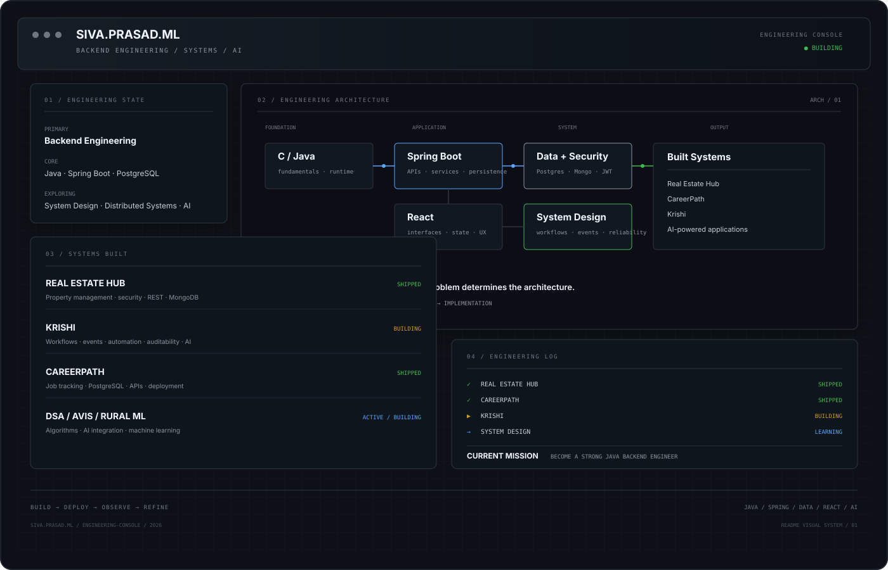

<div align="center">



</div>

---

### About

Computer Science & Engineering student focused on backend engineering with Java and Spring Boot. I build across the stack when necessary, with particular interest in APIs, data, security, workflows, and system design.

---

### Engineering Snapshot

**Backend**  
Java · Spring Boot · Spring Security · REST APIs · JPA / Hibernate

**Data & Infrastructure**  
PostgreSQL · MongoDB · Docker · Git · GitHub Actions · Render · Vercel

**Frontend**  
React · Vite · JavaScript · Tailwind CSS

**AI Integration**  
FastAPI · TensorFlow · Keras · AI APIs

---

### Selected Systems

- **Real Estate Hub** — Full-stack property management and marketplace platform with RBAC & REST APIs `SHIPPED`
- **CareerPath** — Job application and interview tracking platform built on relational data models `SHIPPED`
- **Krishi** — Workflow-driven agricultural operations platform with event-driven backend & AI integration `BUILDING`
- **Avis** — AI-powered personal assistant `BUILDING`
- **DSA Preps** — Data structures and algorithms implementation & complexity analysis in Java and C `ACTIVE`
- **Rural Infrastructure Classification** — Machine learning dataset preparation & model classification project `COMPLETED`

---

### Current Focus

* **Backend Engineering:** Deepening Java internals, Spring Security, transaction management, RESTful API design, and persistence strategies.
* **System Design:** Studying fault tolerance, caching mechanisms, messaging queues, and how monolithic services evolve into scalable architectures.
* **Data Structures & Algorithms:** Strengthening problem-solving fundamentals, time/space complexity analysis, and data structure implementations using C and Java.
* **AI Systems:** Integrating LLM/ML inference APIs and asynchronous worker pipelines into production backend services.

---

### Engineering Principles

```text
Problem → Domain → Data → Workflow → Architecture → Implementation → Deployment → Observation → Iteration
```

* **Understand the problem** before selecting the technology.
* **Model the domain** before turning everything into CRUD.
* **Treat data modeling** as a core part of backend engineering.
* **Design with deployment and failure in mind.**
* **Use AI** where it provides genuine application value.

---

### Connect

**LinkedIn:** [linkedin.com/in/sivaprasadml](https://www.linkedin.com/in/sivaprasadml) · **Email:** [sivaprasadml2k5@gmail.com](mailto:sivaprasadml2k5@gmail.com) · **GitHub:** [github.com/Sivaprasad2k](https://github.com/Sivaprasad2k)
